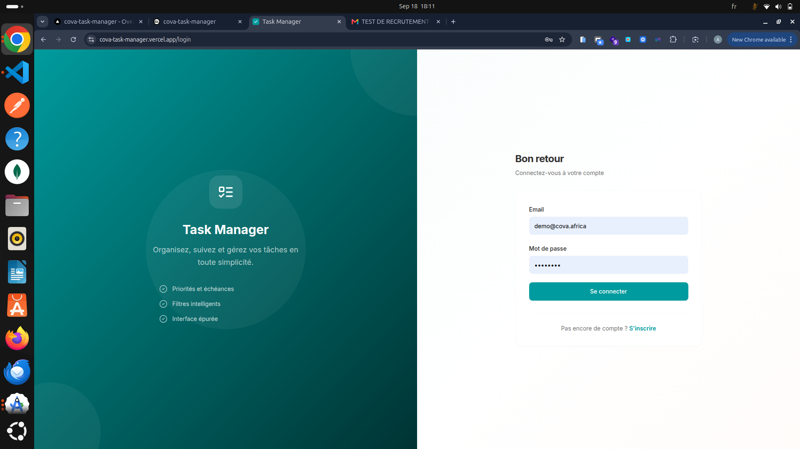
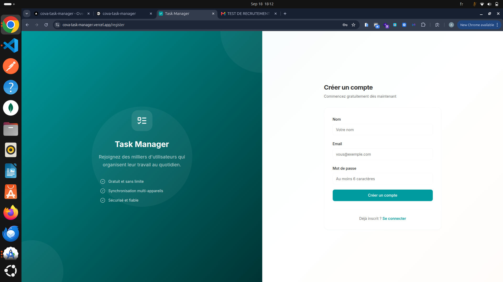
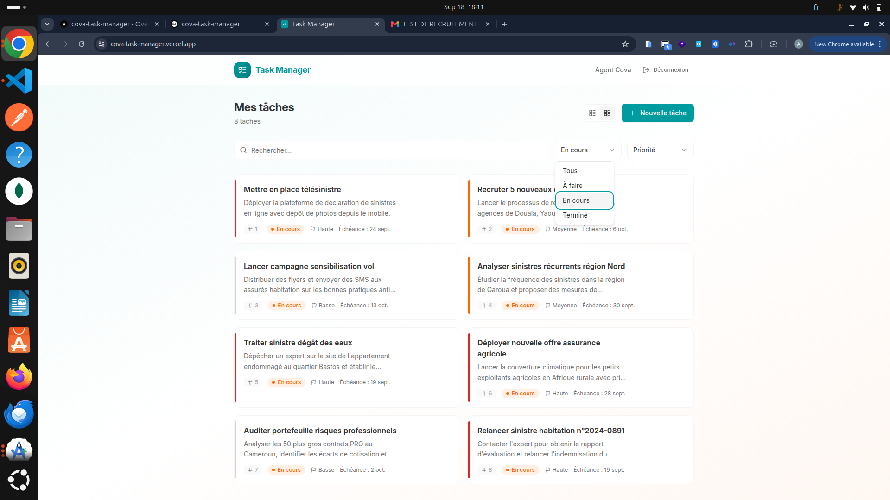
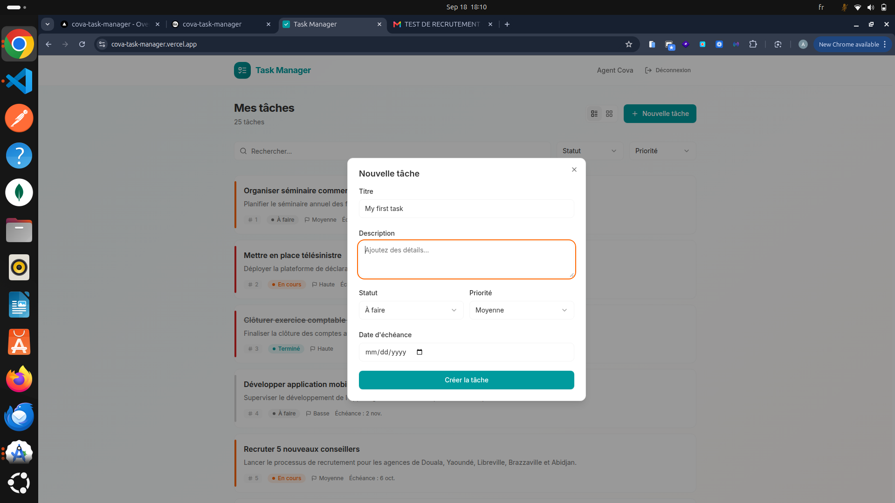
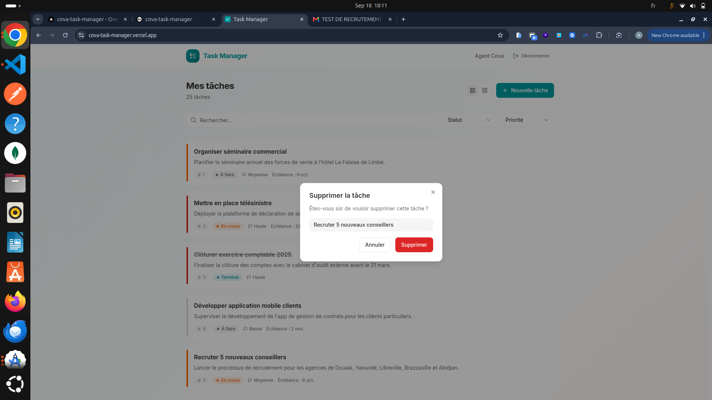
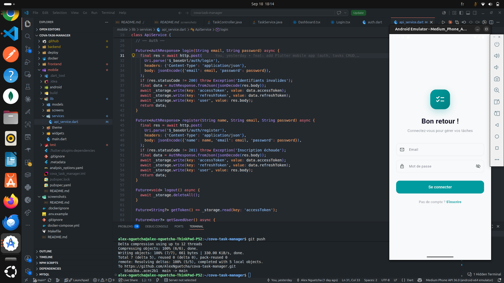
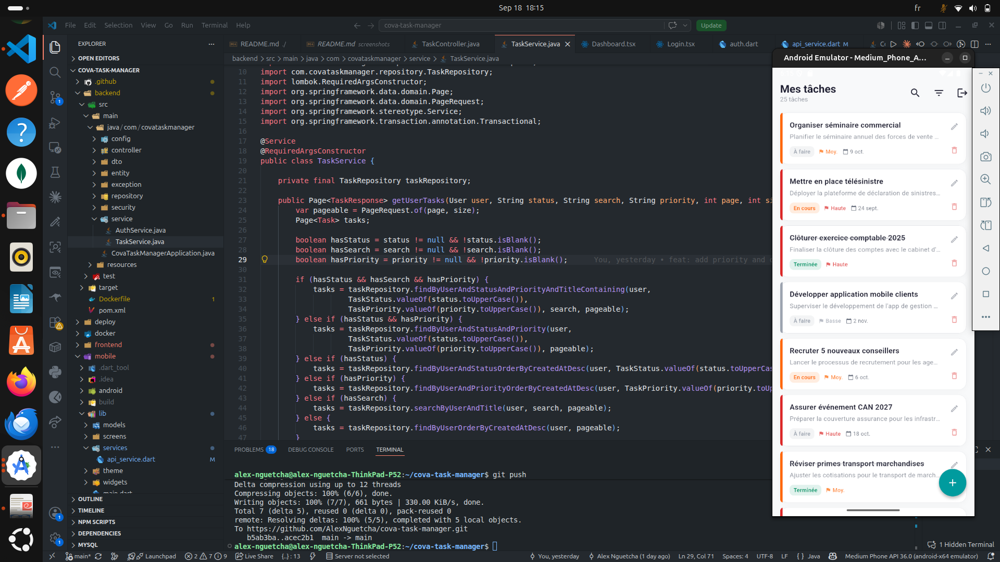
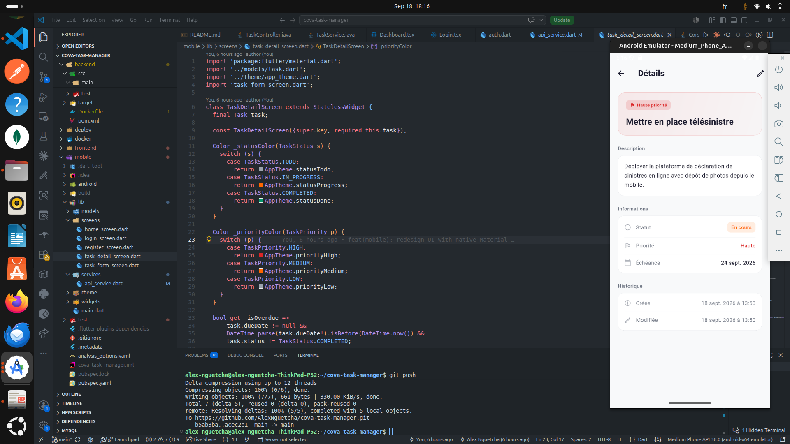

# Cova Task Manager

Task Manager - Spring Boot, React + Vite, Flutter.  
Déploiement sur Vercel + Railway.

---

## Stack

| Domaine | Technologie |
|---------|-------------|
| Backend | Java Spring Boot, Spring Data JPA, Spring Security + JWT, MySQL |
| Frontend | React + Vite + TypeScript, Shadcn UI + Tailwind, TanStack Query |
| Mobile | Flutter + Dart |
| CI/CD | GitHub Actions, Docker |

---

## Démarrer rapidement

```bash
git clone https://github.com/AlexNguetcha/cova-task-manager.git
cd cova-task-manager

# Tout avec Docker
docker compose up --build
```

| Service | URL |
|---------|-----|
| Frontend | http://localhost |
| API | http://localhost:8080 |
| Swagger | http://localhost:8080/swagger-ui.html |
| MySQL | localhost:3307 |

**Demo :** `demo@cova.africa` / `demo1234`

---

## Déploiement

### 🔗 Liens

| Service | URL |
|---------|-----|
| **Frontend** | [https://cova-task-manager.vercel.app](https://cova-task-manager.vercel.app) |
| **Backend API** | [https://cova-backend.up.railway.app](https://cova-backend.up.railway.app) |
| **Swagger UI** | [https://cova-backend.up.railway.app/swagger-ui.html](https://cova-backend.up.railway.app/swagger-ui.html) |

### Backend → Railway

1. Créer un compte sur [railway.app](https://railway.app) (GitHub login)
2. Cliquer **New Project** → **Deploy from GitHub repo**
3. Sélectionner `cova-task-manager`
4. Dans **Settings**, définir :
   - **Root Directory** : `backend`
   - **Start Command** : `./mvnw spring-boot:run -Dspring-boot.run.profiles=railway`
5. Ajouter un **MySQL** addon (Railway le crée automatiquement)
6. Ajouter les variables d'environnement :

   | Variable | Valeur |
   |----------|--------|
   | `JWT_SECRET` | une clé secrète (min 256 bits) |
   | `SPRING_PROFILES_ACTIVE` | `railway` |
   | `MYSQL_HOST` | laissé vide (Railway injecte automatiquement) |
   | `MYSQL_PORT` | `3306` |
   | `MYSQL_DATABASE` | `railway` |
   | `MYSQL_USER` | fourni par Railway |
   | `MYSQL_PASSWORD` | fourni par Railway |

7. Railway génère une URL : `https://cova-backend.up.railway.app`

### Frontend → Vercel

1. Créer un compte sur [vercel.com](https://vercel.com) (GitHub login)
2. Cliquer **Add New** → **Project**
3. Sélectionner `cova-task-manager`
4. Configurer :
   - **Root Directory** : `frontend`
   - **Framework Preset** : `Vite`
5. Ajouter la variable d'environnement :

   | Variable | Valeur |
   |----------|--------|
   | `VITE_API_URL` | `https://cova-backend.up.railway.app` |

6. Déployer → Vercel génère une URL : `https://cova-task-manager.vercel.app`

> Le fichier `vercel.json` est déjà configuré pour rediriger `/api/*` vers le backend Railway.

---

## Captures d'écran

### Web

| Page | Aperçu |
|------|--------|
| Connexion |  |
| Inscription |  |
| Liste des tâches (grille) |  |
| Nouvelle tâche |  |
| Suppression |  |

### Mobile (Flutter)

| Page | Aperçu |
|------|--------|
| Connexion |  |
| Liste des tâches |  |
| Détails d'une tâche |  |

---

## Tests

```bash
cd backend && mvn verify    # JUnit + Mockito
cd frontend && npm test      # Vitest
```

---

## Auteur

**Alex Nguetcha** - [GitHub](https://github.com/AlexNguetcha)
